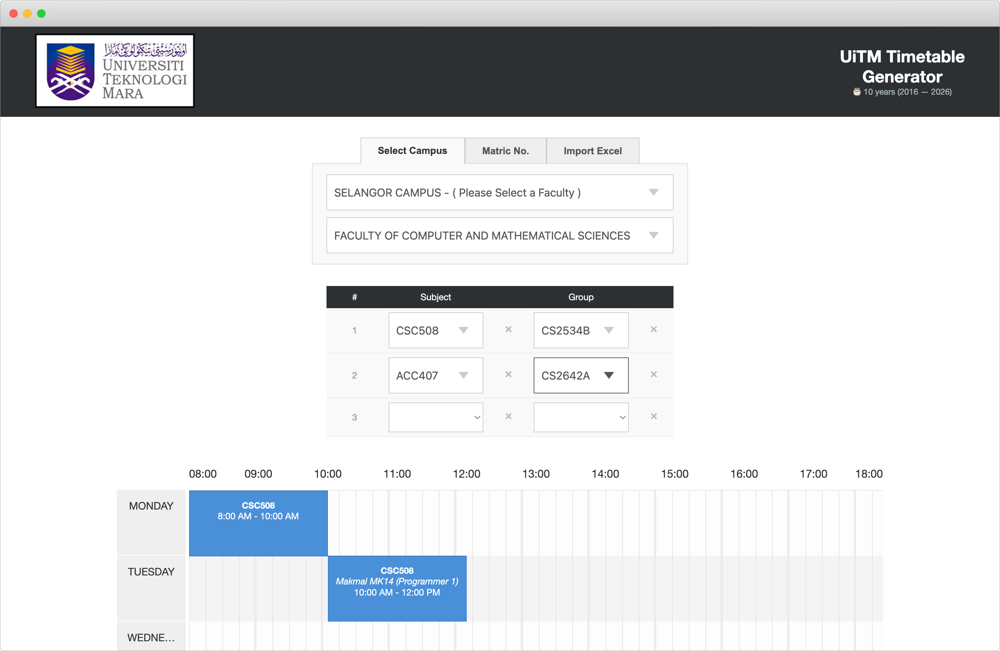

# UiTM Timetable Generator

🎂 **Celebrating 10 years!** (2016 — 2026)

Fetch and generate timetable from iCRESS UiTM.

Official website: https://uitmtimetable.com (thanks [Adib](https://github.com/adibzter))



## Features

- Select campus/faculty and manually pick subjects and groups
- Auto-fetch timetable by matric number
- Import/export timetable as Excel (.xlsx)
- Export timetable as image (PNG) or PDF
- Customizable colour scheme per subject
- iCRESS health check with downtime banner

## Installation

1. Drop all files into your web server directory (e.g. `/var/www/html` for Apache).
2. Set correct permissions for the cache directory:
   ```
   sudo chown -R www-data:www-data /path/to/UiTM-Timetable-Generator/
   sudo find /path/to/UiTM-Timetable-Generator/ -type f -exec chmod 644 {} \;
   sudo find /path/to/UiTM-Timetable-Generator/ -type d -exec chmod 755 {} \;
   ```
3. Adjust `config.php` to suit your needs.

## Usage

1. **Manual mode** - Select campus/faculty, pick subjects and groups.
2. **Matric number** - Enter your matric number to auto-fetch your registered timetable.
3. **Import Excel** - Import a previously exported `.xlsx` timetable file.
4. (Optional) Customise colours and export as image, PDF, or Excel.

## Credits

- **Afif Zafri** - Original creator ([Facebook](https://facebook.com/afzafri))
- **Mohd Shahril** - Regex code, major code overhaul and improvement ([Facebook](https://facebook.com/mohdshahril.net))
- **Syed Muhammad Danial** - UI improvement ([Facebook](https://facebook.com/syedmdanial.sd))
- **Adib Zaini** - Current maintainer, domain and hosting sponsor ([Twitter](https://twitter.com/adibzter))
- **Muhammad Nabil** - Previous domain and hosting sponsor
- **Naim** ([@naimhasim](https://github.com/naimhasim)) - PDF export feature

### Libraries

- [Timetable.js](https://github.com/Grible/timetable.js)
- [html2canvas](https://github.com/niklasvh/html2canvas)
- [blob-select](https://github.com/Blobfolio/blob-select)
- [jsPDF](https://github.com/parallax/jsPDF)
- [ExcelJS](https://github.com/exceljs/exceljs)

## Contributing

1. Fork it
2. Create your feature branch: `git checkout -b my-new-feature`
3. Commit your changes: `git commit -am 'Add some feature'`
4. Push to the branch: `git push origin my-new-feature`
5. Submit a pull request

## Disclaimer

We are not affiliated, associated, authorized, endorsed by, or in any way officially connected with Universiti Teknologi MARA (UiTM), or any of its subsidiaries or its affiliates. The official UiTM website can be found at https://www.uitm.edu.my/.

## License

MIT - see the [LICENSE](LICENSE) file.
